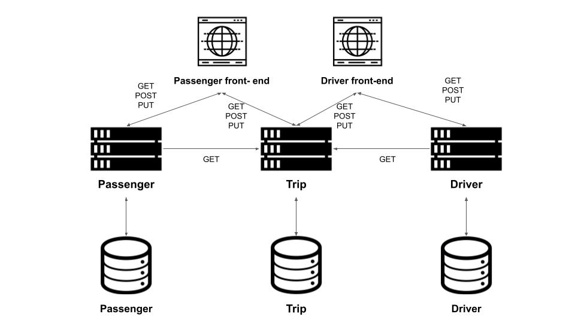

# ETI
Dickson, S10192803

1. Design consideration
Front-end architecture

For the front-end I have chosen to use the component based front-end. To help simulate the component based, I have developed the front-end using forms, Ajax, jQuery, and drop-down list to simulate the component based. As the common component is the forms and the message. Therefore, the jQuery would handle when to hide and show the appropriate components. And the Ajax would be responsible for retrieving and sending the data through the API to the microservices while displaying the response in the message component.
	
Anti-corruption layer

The anti-corruption layer was created as a layer in the microservice itself. One example is the API Router in passenger and driver’s microservice, as this layer would be in charge handling the raw data and translate the requests to the appropriate functions so that the database is able to retrieve the appropriate records. This layer checks if the value can convert to int, is valid and if it exists in the database.
	
Decomposition & DDD

The microservices has been decomposed by their subdomain and business domain. As the core business domain is the ride sharing, therefore the trip domain will be in the center of the diagram while both passengers and drivers are loosely coupled with the trip domain. 
	
The trip domain is being defined by the context of both passengers and driver. As in the passenger context it would only able to manipulate or retrieve the Trip’s status, location and time for drop off and pick up, . Whereas driver would need to access the trip to view trip details and complete trips. 

Functions
Passenger 
- Login passenger account (GET)
- Create Passenger account (POST)
- Edit Passenger account (PUT)
- Book trip (POST)
- View all trip (GET)
Driver
- Login Driver account (GET)
- Create Driver account (POST)
- Accept booking/ View job (GET/ PUT)
- Pick up passenger (PUT)
- Complete trip (PUT)

2. Architecture diagram

3. Instructions for setting up and running the microservice
3.1 Setting up database
- Download XAMPP
- Update Portnumber to 3308 in XAMPP Config file
* https://www.phpflow.com/php/how-to-change-xampp-apache-server-port/ - instructions
- Go to PHPMyAdmin
- Set password for all account
* UserAccount > root > change password to 'password'
- Create new database
- Insert SQL code via 'rideshare.sql' OR 'SQL.txt'
* Please do not insert all the SQL statement at once for SQL.txt
- Click 'GO'

3.2 Installation
- git clone https://https://github.com/DicksonKuan/ETI
- go get -u github.com/go-sql-driver/mysql
- go get -u github.com/gorilla/mux
- go get -u github.com/gorilla/handlers

3.2 Run & Test API
- Launch command prompt and run
* Trip folder, Main.go
* Customer folder, Main.go
* Driver folder, Main.go
- Test HTML

Lib and platform used
- https://github.com/gorilla/mux
- https://github.com/gorilla/handlers
- https://github.com/go-sql-driver/mysql
- XAMPP
- Visual studio code
